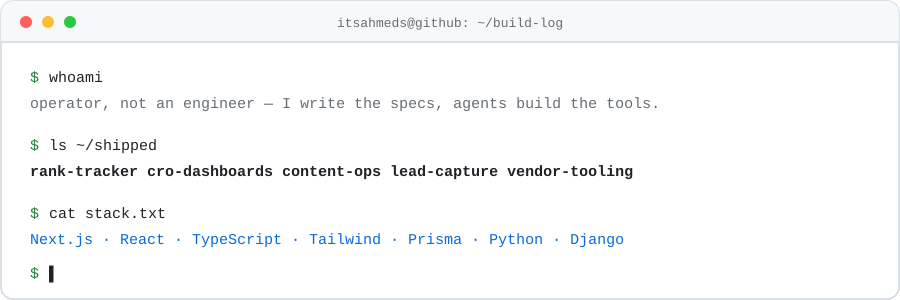

<picture>
  <source media="(prefers-color-scheme: dark)" srcset="assets/banner-dark.svg">
  
</picture>

### I run organic growth at a B2B software marketplace — SEO, content operations, conversion.

The unusual part is that I stopped filing tickets for the tooling I need.

Most growth people wait on engineering. I got tired of waiting, so I learned to write specifications precise enough that AI agents can build against them. The dashboards, trackers and pipelines my team runs on are things I shipped myself.

This account is a year old. There are 36 repositories in it. Most are private, because internal tooling is internal — but here's what they are.

---

## What's in there

| System | The problem it solved | Built with |
| :--- | :--- | :--- |
| **Rank tracker** | Per-seat SEO platforms get expensive fast, and none of them tracked the cuts we actually cared about | Python |
| **SERP & vendor research** | Competitor and vendor intelligence pulled off the SERP at volume, on a schedule, instead of by hand | TypeScript |
| **CRO dashboards** | GA4 and on-site conversion data lived in different tabs, so nobody looked at either | Next.js 16 · React 19 · Tailwind v4 |
| **Content ops pipeline** | Briefs, drafts, QA and publishing tracked across ten tools and one prayer | Python |
| **Inbound ops** | Lead capture and routing that doesn't need a CRM seat for every person who touches it | Next.js · Prisma |
| **Vendor directory & review tooling** | Vendor profiles, review queues, and automated QA on both | Next.js · TypeScript |
| **Pricing research** | Competitive pricing, pulled and normalised, instead of copied into a spreadsheet every quarter | TypeScript |
| **CMS extensions** | The editor didn't do the one thing the content team needed, so I made it | JavaScript |

---

## How it gets built

I don't vibe-code. I built a framework specifically to stop myself from doing that.

**SDD — spec-driven development.** A twenty-step gated chain:

```
problem → research → requirements → platform → blueprint → UX → architecture → structure → roadmap
                                         ↓
                    feature → tasks → build → verify → ship ──┐
                        ↑                                     │
                        └─────────────────────────────────────┘
```

Nothing gets built until the document in front of it is approved. That's enforced with hooks, not willpower.

The point isn't ceremony. It's that a non-engineer directing agents needs **more** process discipline than an engineer typing, not less — because I can't catch a bad decision by feel halfway through an implementation. So I catch it in the spec, where it's cheap.

---

## Stack

**Ship:** Next.js · React · TypeScript · Tailwind · Prisma
**Scrape, score and schedule:** Python · Django · Shell
**Direct:** Claude Code · spec-driven workflows · custom agent skill chains

---

## On the public shelf

**[food-supply-chain-forecaster](https://github.com/itsahmeds/food-supply-chain-forecaster)** — my computer science final year project. AI-driven demand forecasting for food supply chain management: Django, a forecasting engine, inventory and reporting modules, and synthetic data generation for evaluation.

---

## Talk to me

If you work in growth or content and you've been told *"engineering doesn't have bandwidth this quarter"* — there is another path. I'm happy to talk about what actually worked, and about the three weeks I wasted finding out what doesn't.

<sub>Specs first. Agents second. Ship anyway.</sub>
