I build things and I solve problems. I'm also lazy in the useful sense: if something takes three steps I'll happily spend an afternoon making it one, as long as that one step still works every time. Most of what's in here started as a small annoyance.

  
  
  

  
  

last updated 2026-09-14
