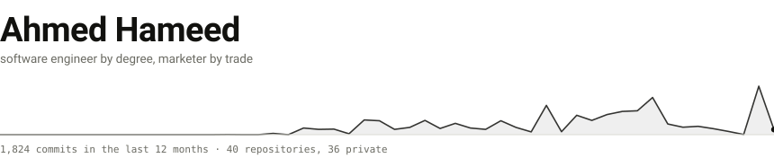

<picture>
  <source media="(prefers-color-scheme: dark)" srcset="assets/mark-dark.svg">
  
</picture>

I build things and I solve problems.

I work in growth and SEO, but my degree is in software engineering, so when the eng backlog is full I just go and build the thing myself. Content pipelines, crawlers, a CRM, dashboards, a headless CMS, an AI reviewer that grades drafts before an editor sees them.

I write a spec before anything gets built, agents do most of the typing, and n8n and Make run whatever has to keep running afterwards.

`next.js` `typescript` `python` `fastapi` `postgres` `n8n` `make.com` `claude code`

[ahmedsheikh2654@gmail.com](mailto:ahmedsheikh2654@gmail.com) · [linkedin](https://www.linkedin.com/in/ahmed-hameed-037676253/)
