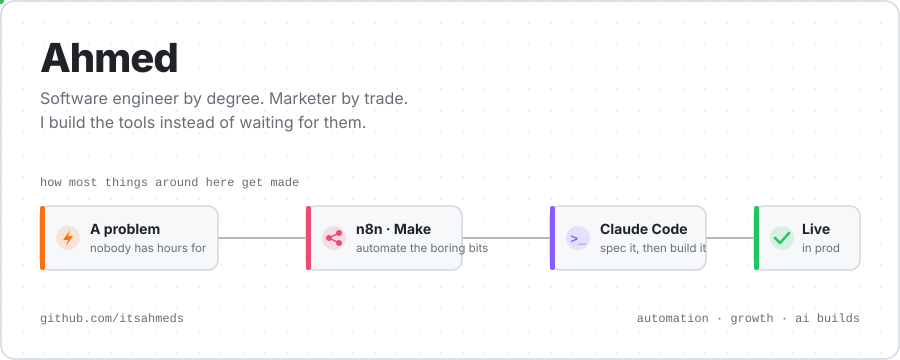
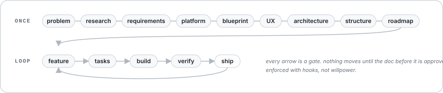

<picture>
  <source media="(prefers-color-scheme: dark)" srcset="assets/hero-dark.svg">
  
</picture>

### Let's state the obvious. Marketing teams always have more ideas than engineering has hours.

Every growth person knows the feeling. You spot the thing that would move the needle, you write the ticket, and it lands in a backlog behind eleven other tickets. Two quarters later it's still there.

So I stopped filing tickets and started building the stuff myself.

I run SEO, content operations and conversion for a B2B software marketplace. I have a software engineering degree. And I spend a lot of my week inside n8n, Make.com and Claude Code, turning "wouldn't it be nice if" into things that actually run in production.

This account is where that work lives. Most of it is private (internal tooling is internal), but here's what's in there.

## What I've actually shipped

| | What it does | Under the hood |
| :--- | :--- | :--- |
| **Publishing control system** | One pipeline for how pages get requested, planned, written and published. Tracks 24,000+ pages across 6 content types with live CMS sync, two-way Jira, and AI duplicate detection so nobody writes the same page twice. | Next.js 16 · Prisma 7 · Supabase · BullMQ · Playwright |
| **Content ops pipeline** | Finds pages that are going stale, refreshes them on a schedule, and pings the team when something needs a human. My biggest project by a mile (480+ commits). | Python · Next.js · Postgres |
| **AI editorial review** | Upload a draft, get a scored critique against a 7-metric rubric with the exact passage, the fix, and the reasoning. Exports straight back as Word comments. 49 tests passing. | FastAPI · OpenRouter · Railway |
| **Rank tracker** | 1,000 keywords a run, 6 countries, desktop and mobile. Tracks AI Overviews and featured snippets too, because that's where the clicks went. | FastAPI · Next.js · DataForSEO |
| **Review extraction** | Pulls every review of any vendor off G2, Capterra and Software Advice in one go. Batched so it never trips the serverless timeout. | Next.js 16 · Firecrawl · Upstash · Vercel Blob |
| **SERP vendor research** | Type a keyword. It reads the SERP, picks the real listicles out of the noise, scrapes them, and hands back a ranked vendor list. | Next.js · SerpAPI · Firecrawl · Claude |
| **CRO dashboards** | GA4 and on-site conversion data finally in the same place, so people actually look at it. | Next.js 16 · React 19 · Tailwind v4 |
| **Pricing research** | Competitor pricing pulled and normalised in one click instead of a quarterly spreadsheet marathon. | Next.js · TypeScript |

And a bunch of smaller things: a CMS editor extension, a vendor checklist app, a pay-per-lead vendor directory, a QA checker. The unglamorous stuff that saves someone an hour every day.

## The glue is automation

Here's the thing most people miss about all of the above. The apps are only half of it.

The other half is n8n and Make.com workflows quietly moving data between them. Form fills that become CRM records. Scrape jobs that kick off on a schedule. Slack pings when a page goes live. Sheets that update themselves. None of that is in a repo, because it doesn't need to be. It just runs.

If you're a marketer and you haven't opened n8n yet, that's your homework. It's the most useful skill I've picked up in years.

## How it gets built

I don't vibe-code. I tried it. It falls apart the second a project gets bigger than a weekend.

So I built a framework to stop myself: a 20-step chain of Claude Code skills I call SDD, spec-driven development.

<picture>
  <source media="(prefers-color-scheme: dark)" srcset="assets/sdd-dark.svg">
  
</picture>

Why so much process for a one-person shop?

Because when you're directing agents, a bad decision at the spec stage costs you an hour. The same bad decision discovered halfway through a build costs you a week. I'd rather catch it where it's cheap.

## On the side

Outside the day job I take on builds for other people, and I'm building something of my own.

A full CRM for a lead-gen agency: email and WhatsApp outreach, LinkedIn decision-maker search, Google Maps lead scraping, multi-tenant workspaces. Live and in daily use.

A company website with its own CMS. Next.js, 250+ commits, deployed on Railway.

An attendance app with WiFi and geofence check-ins, owner/admin/employee roles, everything managed from the phone. Node and React Native.

And a startup I'm building from the spec up. I'm the founder. Claude Code agents are the technical co-founder. 180+ commits of specs, decision records and a multi-locale foundation before a single marketing page went live. More on that when it launches.

Plus my second brain: an Obsidian vault wired into Claude Code with a CLAUDE.md. Weekly reflections, experiments, wins. The world forgets. I don't.

## Out in the open

**[food-supply-chain-forecaster](https://github.com/itsahmeds/food-supply-chain-forecaster)** is my final year project. AI-driven demand forecasting for food supply chains: Django, a forecasting engine, inventory and reporting modules, and synthetic data generation so you can actually test it.

## Say hi

If you're in growth or content and you've ever been told "engineering doesn't have bandwidth this quarter", I promise there's another way. Happy to talk shop.

📧 [ahmedsheikh2654@gmail.com](mailto:ahmedsheikh2654@gmail.com) &nbsp;·&nbsp; 💼 [LinkedIn](https://www.linkedin.com/in/ahmed-hameed-037676253/)

Automate the boring bits. Spec the rest. Ship anyway.
